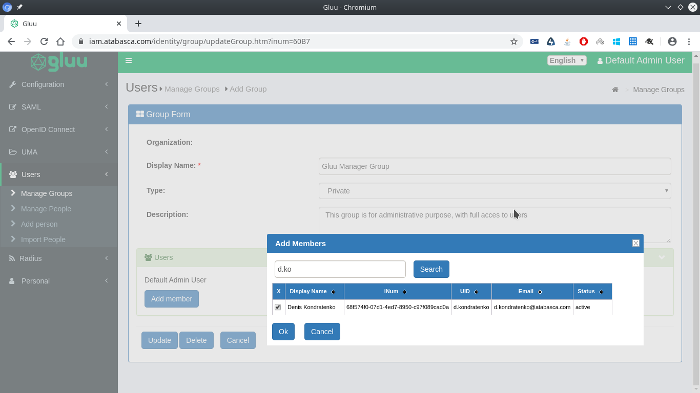
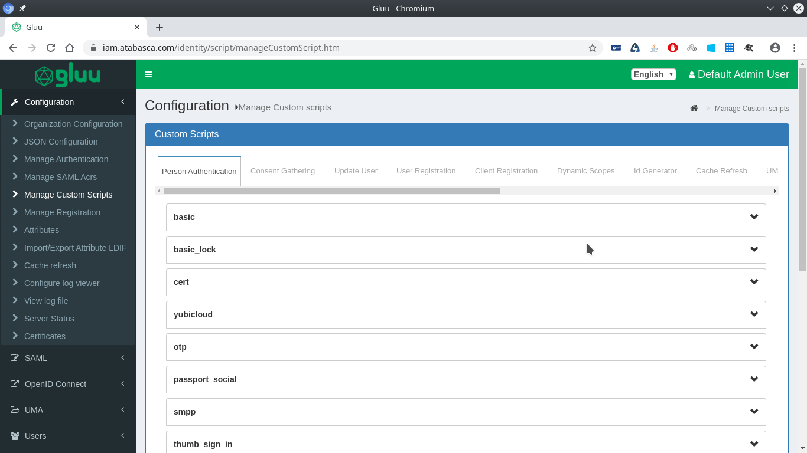
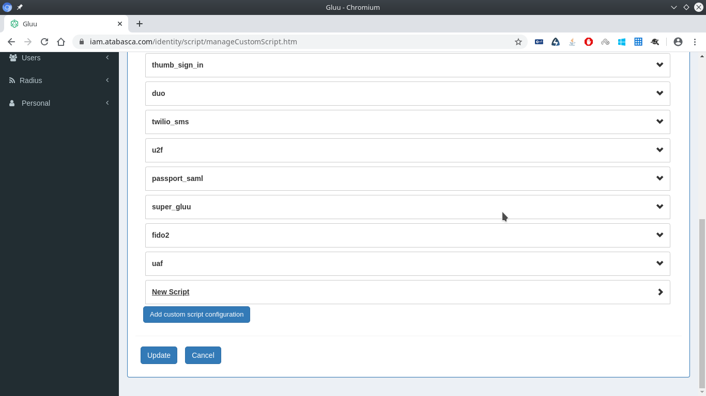
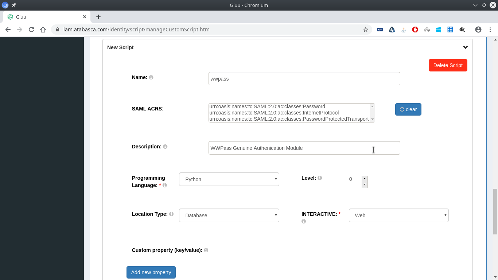
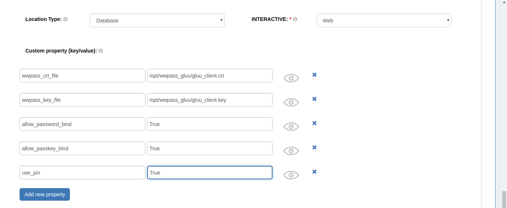
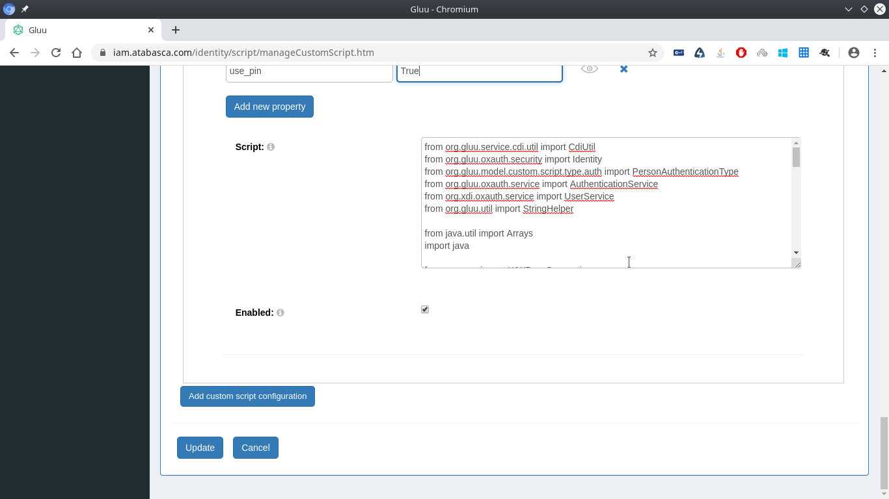

# Setting Up WWPass Authentication in Gluu Server

## Introduction

[WWPass](https://wwpass.com/) replaces the traditional username and password
login with a more advanced multi-factor authentication solution. WWPass employs
strong cryptography and robust combination of authentication factors to deliver
a secure and user-friendly authentication experience. WWPass authentication
starts with a smartphone app or a hardware token as the first authentication
factor. Then additional authentication factors such as PIN or biometrics can be
added to verify the user identity further.

[Gluu Server](https://gluu.org/docs/gluu-server/4.1/) is a container
distribution of free open source software (FOSS) for identity and access
management (IAM). Gluu Server combines SAML 2.0, LDAP, OpenID Connect,
and other authentication and authorization protocol implementations to create
a platform for user authentication, identity information, and policy decisions.

Combining WWPass strong multi-factor authentication with the versatility of
Gluu Server helps to build secure IAM solutions that can be used for single
sign-on (SSO), customer identity and access management (CIMA), and identity
federation.

## Prerequisites

This tutorial assumes that you have the following:

- Gluu Server 4.1.1 installed on Ubuntu Server 18.04 or 16.04;
- An administrative account on this Ubuntu Server;
- An application certificate and private key for WWPass authentication;
- WWPass Key app or hardware token;
- Basic knowledge of HTML and CSS;

### Obtain Application Certificate and Private Key From WWPass

To obtain an application certificate and private key go to
[wwpass.com](https://wwpass.com), click **Sign Up** to create a developer
account and **Log In** if you already have an account. Then follow the website
instructions to register your application domain and issue the application
certificate.

### Install Gluu

To install Gluu Server follow the
[instructions on the Gluu website](https://gluu.org/docs/gluu-server/installation-guide/install-ubuntu/).

Note, it is very difficult to change the Gluu domain name (FQDN) after setup.
There is no configuration option for this in Gluu. Changing the domain name
manually in configuration files causes lots of side effects. Be sure to choose
the domain name before setting up Gluu Server.

Do not forget to save the LDAP and oxTrust admin passwords. It is extremely
difficult to reset these passwords in case they are lost or forgotten.
We suggest using [PassHub](https://passhub.net) to store these passwords.

When setting up Gluu with  ```setup.py```,  select "**Yes**" when asked
to install the following components:

- memcached
- oxAuth OAuth2
- oxTrust Admin UI
- Apache HTTPD Server
- Shibboleth SAML IDP
- Gluu Radius

Review the configuration settings and type "**Yes**".

Configuration settings should look like this:

```console
hostname                                          iam.example.com
orgName                                               Example inc.
os                                                         ubuntu
city                                                       Nashua
state                                                          NH
countryCode                                                    US
Applications max ram                                         3072
Install oxAuth                                               True
Install oxTrust                                              True
Backends                                                   wrends
Java Type                                                     jre
Install Apache 2 web server                                  True
Install Shibboleth SAML IDP                                  True
Install oxAuth RP                                           False
Install Passport                                            False
Install Casa                                                False
Install Oxd                                                 False
Install Gluu Radius                                          True
```

### Import Users to Gluu

If you have an account management infrastructure (i.e. Active Directory,
OpenLDAP, eDirectory), make sure to connect them with Gluu. To import
users to your Gluu server, refer to Gluu instruction videos
[Part 1/3](https://www.gluu.org/gluu-server-cache-refresh-configuration-part-1/),
[Part 2/3](https://www.gluu.org/gluu-server-cache-refresh-configuration-part-2/),
[Part 3/3](https://www.gluu.org/gluu-server-cache-refresh-configuration-part-3/).

There are also instructions on the Gluu website for
[LDAP sync](https://gluu.org/docs/gluu-server/user-management/ldap-sync/),
and [LDAP Authentication](https://gluu.org/docs/gluu-server/authn-guide/basic/).

If you don’t have any account management infrastructure or plan to use local
Gluu accounts, create users and groups before proceeding with WWPass integration.
Refer to: [Gluu documentation](https://gluu.org/docs/gluu-server/user-management/local-user-management/#manage-people).

We suggest creating a separate account in Gluu for each Gluu administrator.
Create a new user and add it to the Gluu Manager group.
See [Group management](https://gluu.org/docs/gluu-server/user-management/local-user-management/#manage-groups-in-oxtrust).



### Gluu Container

Gluu Server runs in an isolated container located at `/opt/gluu-server/`.
To start a shell in the container use

```console
sudo gluu-serverd login
```

To check if you are inside a container, run

```console
systemd-detect-virt -c
```

If you are inside a Gluu container, the command prints `systemd-nspawn`.
Otherwise, it prints `none`.

To exit a Gluu container use

```console
exit
```

### Update Gluu to 4.1.1

If you use 4.x.x version of Gluu Server, you should update it to 4.1.1
(the latest version available at the time this document was created).
Gluu Server versions prior to 4.1.1 contain a few bugs that affect
integrations with many SAML service providers.

First download updated files:

- https://ox.gluu.org/maven/org/gluu/oxtrust-server/4.1.1.Final/oxtrust-server-4.1.1.Final.war
- https://ox.gluu.org/maven/org/gluu/oxshibbolethIdp/4.1.1.Final/oxshibbolethIdp-4.1.1.Final.war
- https://ox.gluu.org/maven/org/gluu/oxauth-server/4.1.1.Final/oxauth-server-4.1.1.Final.war

Stop Gluu services:

```console
sudo /sbin/gluu-serverd stop
```

Backup existing Gluu Server files and install new files:

```console
sudo mv /opt/gluu-server/opt/gluu/jetty/identity/webapps/identity.war identity.war-4.1.0
sudo cp oxtrust-server-4.1.1.Final.war /opt/gluu-server/opt/gluu/jetty/identity/webapps/identity.war

sudo mv /opt/gluu-server/opt/gluu/jetty/idp/webapps/idp.war idp.war-4.1.0
sudo cp oxshibbolethIdp-4.1.1.Final.war /opt/gluu-server/opt/gluu/jetty/idp/webapps/idp.war

sudo mv /opt/gluu-server/opt/gluu/jetty/oxauth/webapps/oxauth.war oxauth.war-4.1.0
sudo cp oxauth-server-4.1.1.Final.war /opt/gluu-server/opt/gluu/jetty/oxauth/webapps/oxauth.war
```

Start Gluu Server:

```console
sudo /sbin/gluu-serverd start
```

## Prepare WWPass Integration Files

Download WWPass integration files from GitHub
[https://github.com/wwpass/gluu/archive/master.zip](https://github.com/wwpass/gluu/archive/master.zip).

Extract the files

```console
unzip master.zip
```

Go to the “gluu-master” directory (`cd gluu-master`) and copy files
and directories as follows:

Note, some of the files are relative symlinks. When deploying make sure to copy
directory content, not the symlinks themselves. Also make sure all file and
directory operations are performed outside the Gluu container.

Files in `oxauth` directory should be deployed to
`/opt/gluu-server/opt/gluu/jetty/oxauth/custom/`

```console
sudo cp -rL oxauth/* /opt/gluu-server/opt/gluu/jetty/oxauth/custom/
```

Files in `oxtrust` directory should be deployed to
`/opt/gluu-server/opt/gluu/jetty/identity/custom/`

```console
sudo cp -rL oxtrust/* /opt/gluu-server/opt/gluu/jetty/identity/custom/
```

Files in `idp` directory should be deployed to
`/opt/gluu-server/opt/gluu/jetty/idp/custom/`

```console
sudo cp -rL idp/* /opt/gluu-server/opt/gluu/jetty/idp/custom/
```

Copy `wwpass.py` to `/opt/gluu-server/opt/gluu/python/libs/`

```console
sudo cp wwpass.py /opt/gluu-server/opt/gluu/python/libs/
```

Copy `ticket.json` to `/opt/gluu-server/opt/wwpass_gluu/cgi`

``` console
sudo mkdir -p /opt/gluu-server/opt/wwpass_gluu/cgi
sudo cp ticket.json /opt/gluu-server/opt/wwpass_gluu/cgi
```

Make sure `ticket.json` is executable

```console
sudo chmod 755 /opt/gluu-server/opt/wwpass_gluu/cgi/ticket.json
```

Copy WWPass application certificate and private key to
`/opt/gluu-server/opt/wwpass_gluu/`
(assuming the certificate and key files are in your home directory)

```console
sudo cp ~/gluu_client.crt /opt/gluu-server/opt/wwpass_gluu/gluu_client.crt
sudo cp ~/gluu_client.key /opt/gluu-server/opt/wwpass_gluu/gluu_client.key
```

Replace `~/gluu_client.crt` and `~/gluu_client.key` with the names and location
of your certificate and key files.

Copy WWPass CA certificate `wwpass.ca.crt` to `/opt/gluu-server/opt/wwpass_gluu/`

```console
sudo cp wwpass.ca.crt /opt/gluu-server/opt/wwpass_gluu
```

Log in to the Gluu Server container

```console
sudo /sbin/gluu-serverd login
```

Change ownership of files and directories just copied

```console
chown -R jetty:jetty /opt/jetty
chown root:gluu /opt/gluu/python/libs/wwpass.py
```

## Configure Apache

Use your favorite console text editor to change Apache configuration

```console
<vi|nano|joe|...> /opt/gluu-server/etc/apache2/sites-available/https_gluu.conf
```

Scroll down the file until you find the last `<Location>...</Location>` tag and
insert the following snippet below it:

```apache
<Location /wwpass>
  require all granted
</Location>

ScriptAlias "/wwpass/" "/opt/wwpass_gluu/cgi/"

<Directory /opt/wwpass_gluu/cgi/>
  SetHandler cgi-script
  Options +ExecCGI
  Order deny,allow
  Allow from all
</Directory>
```

Save the file and exit the editor.

Enable mod_cgi and restart apache:

```console
a2enmod cgi
systemctl restart apache2
```

Check that `ticket.json` is working.
Go to `https://<your_gluu_host>/wwpass/ticket.json`.
If your setup is correct you will see the following output:

```json
{"result": true, "data": "SPNAME:07629a1963c5e4f4f339ecb852b7a0bf10a90c62@p-sp-05-50:16033", "ttl": 600, "encoding": "plain"}
```

## Configure Gluu Server

Log in as administrator and go to "Configuration -> Manage Custom scripts".


In `Person Authentication` tab, click `Add custom script configuration` at the bottom of the page


Create custom script `wwpass` with Location Type set to `Database`.


Add the following to `Custom Property` fields by clicking on `Add new property` button:

- wwpass_crt_file: /opt/wwpass_gluu/gluu_client.crt
- wwpass_key_file: /opt/wwpass_gluu/gluu_client.key
- registration_url: URL of the registration web application, if you have one. Do not add this property otherwise
- recovery_url: URL for account recovery, if you have one. Do not add this property otherwise.

To require PIN or biometrics during login, add:

- use_pin: True

To enable binding WWPass keys with email, add:

- allow_email_bind: True

Note, your Gluu server should be able to send emails, see
`Configuration -> Organization configuration -> SMTP Server Configuration`.

To enable binding WWPass keys with existing usernames and passwords, add:

- allow_password_bind: True

To enable binding WWPass keys with another WWPass key, add:

- allow_passkey_bind: True



Replace the content of `Script` textbox with the content of `wwpassauth.py` from `gluu-master`

Set `Enabled` checkbox to enable the custom script:


Click the `Update` button.

It's also recommended to increase the unauthenticated session lifetime to give
users more time to bind their WWPass keys.

Go to `Configuration -> JSON configuration -> OxAuth Configuration`, find
`sessionIdUnauthenticatedUnusedLifetime` setting and set it to `600` or more.


Click `Update` to save settings.

### Set up Authentication Method

Before switching to WWPass authentication, make sure you have opened
an administrator session in a different browser (not in a different window,
but a completely different browser). Do not close that browser window and
reload it from time to time to make sure your session does not expire.

Keep the backup session opened until you are sure that WWPass authentication
works properly or you might lock yourself out of Gluu. If that happens, refer to:
[Gluu FAQ](https://gluu.org/docs/gluu-server/operation/faq/#revert-an-authentication-method)

In the Gluu Admin interface, navigate to: "Configuration -> Manage Authentication -> Default Authentication Method"
Set both options to "wwpass".


Click `Update` to save settings.

### Test Your Setup

Open "https://<your.gluu.url>/" in a different browser (not the one you used to
configure Gluu).

Try to sign in to your Gluu server with WWPass and bind your key using either
email or username and password.

If something does not work as expected, return to your main browser and revert
`Configuration -> Manage Authentication -> Default Authentication Method` back
to `auth_ldap_server` while you troubleshoot the problem.

## Troubleshooting

Relevant Gluu log files are:

- `/opt/gluu-server/opt/gluu/jetty/oxauth/logs/oxauth.log`
- `/opt/gluu-server/opt/gluu/jetty/oxauth/logs/oxauth_script.log`

Check the files above for any errors. Errors in `wwpass` interception script
are also displayed in Gluu web interface at 'Configuration -> Manage Custom
scripts'. If there are any errors in the script, its name will be in red and
the script editor will display the red button named "Show Error".

Feel free to contact WWPass at support@wwpass.com if you have troubles
integrating WWPass in your Gluu Server.
